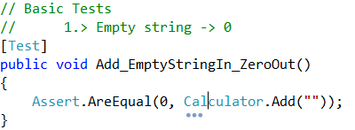
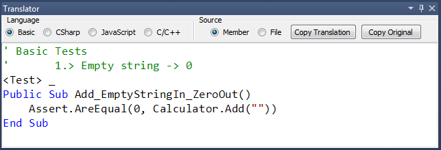

# 'Translation Toolwindow' for CodeRush #
A ToolWindow to translate the active member (or file) to another language.

### Usage ###
Bring up the ToolWindow using **DevExpress\!ToolWindows\Translator**

Place the caret within some code. 

The ToolWindow will translate the active member (or file) to the language specified within the ToolWindow.

**For example:**

A translation from CSharp...

..to Basic

